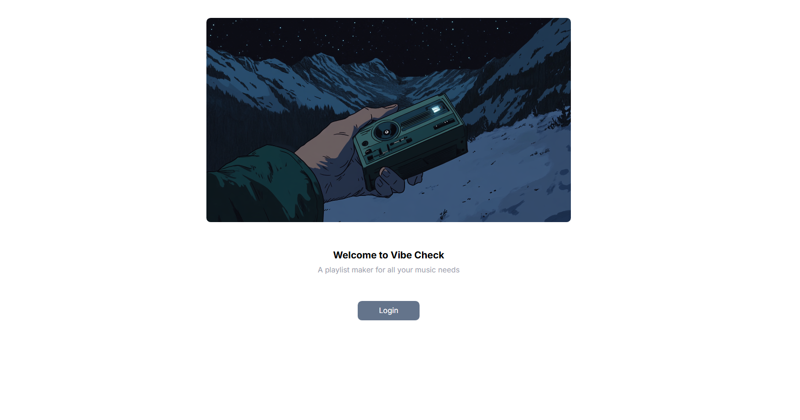
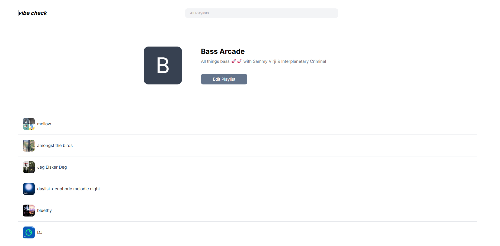
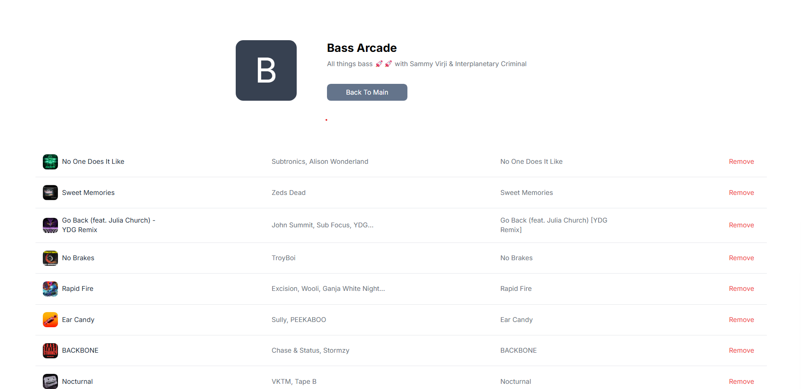

# Playlist Maker (Vibe Check)

This is a website that you can use to create and edit playlists using your Spotify account. The website will recommend songs to your playlist, and any changes you make will be directly synced to your Spotify account.

Please note that this project is a work in progress and began on 11/16/2024.

Login Page


All User Playlists


Edit A Playlist (Recommendation section coming soon!)


## Running Locally

To run this website locally, you just need to:

```npm install```

and

```npm start```


